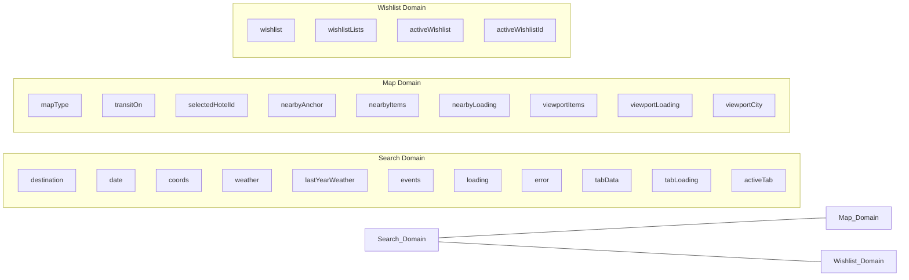

# Validation: Refactoring `useTrip.jsx`

## The Problem — Confirmed and Worse Than Stated

The agents audited the entire codebase. Here are the hard numbers:

### Hook Call Census (70 total in one component)

| Hook | Count | Notes |
|---|---|---|
| `useState` | 22 | 8 UI, 14 server/API, 1 persistence |
| `useRef` | 19 | **9 are mirrors of state** (anti-pattern) |
| `useCallback` | 16 | Most read state via refs to avoid deps |
| `useEffect` | 6 | 2 are just ref-syncing effects |
| `useMemo` | 7 | Including the giant `value` object |
| **Total** | **70** | |

> [!CAUTION]
> **9 out of 19 refs exist solely to mirror state variables** (`destinationRef`, `dateRef`, `coordsRef`, `activeTabRef`, `selectedPlaceIdRef`, `weatherRef`, `tabDataRef`, `wishlistRef`, `viewportItemsRef`). This is a classic symptom of a component doing too much — callbacks can't maintain stable dependency arrays, so refs are used as escape hatches from stale closures.

---

### Consumer Blast Radius — Who Re-renders When?

The context `value` object exposes **~40 properties** via a single `useMemo`. Any state change rebuilds this object and **re-renders all 13 consumer call sites across 12 files**.

| State Change | Trigger Frequency | Components That NEED It | Components That DON'T But Still Re-render |
|---|---|---|---|
| `mapType` toggle | Rarely | MapWidget, MapControlsPanel | Header, WeatherFloat, WeatherWidget, WishlistOverlay, PlacesDrawer, TabbedPlacesWidget, PlanMode, EmptyStateGlobe |
| `transitOn` toggle | Rarely | TransitLayer, MapControlsPanel | All 10 others |
| `viewportItems` update | **Rapidly** (every pan) | MapInner, TabbedPlacesWidget | Header, WeatherFloat, WeatherWidget, WishlistOverlay, MapControlsPanel, HotelInfoCard |
| `wishlist` change | On interaction | WishlistOverlay, TabbedPlacesWidget, EmptyStateGlobe, PlanMode | Header, MapWidget, WeatherFloat, WeatherWidget, MapControlsPanel |
| `destination` keystroke | **Rapidly** | Header | All 12 others |

> [!WARNING]
> **Worst case:** Every map pan fires `viewportItems` → rebuilds the context `value` → re-renders **all 13 call sites** including completely unrelated components like `WeatherFloat` (which only reads `weather`) and `WishlistOverlay` (which only reads wishlist data).

---

### State Domain Breakdown

The audit confirms three cleanly separable domains:

**Cross-domain components** (consume 2+ domains):
- `TabbedPlacesWidget` — All three (19 destructured properties!)
- `PlanMode` — All three
- `MapInner` — Search + Map
- `HotelInfoCard` — Search + Map

**Single-domain components** (pure split candidates):
- `WeatherFloat`, `WeatherWidget` — Search only
- `MapControlsPanel`, `TransitLayer`, `NearbyModeIndicator` — Map only
- `WishlistOverlay` — Wishlist only

---

## Validating the Three Proposed Solutions

### Option 1: Context Splitting — ✅ Valid, with caveats

**My original claim:** Split into `SearchContext`, `MapContext`, `WishlistContext`, `PlacesContext`.

**What the data confirms:**
- The three domains are real and cleanly separable
- 5 components are single-domain consumers → they would **immediately benefit** from zero unnecessary re-renders
- The ref-mirror anti-pattern would persist within each split context

**What I got wrong:**
- I proposed 4 contexts (`PlacesContext` separate from `SearchContext`). The data shows places/tabs are tightly coupled to search — they share `tabData`, `activeTab`, and `fetchTabIfNeeded`. **3 contexts is the right number**, not 4.

**Verdict:** Helps re-renders for single-domain consumers. Does NOT fix the core complexity of API orchestration (race guards, phase 1/phase 2, caching). The `SearchContext` would still be ~400 lines with 4 stale-request refs.

---

### Option 2: Zustand — ✅ Valid and well-suited

**My original claim:** Zustand's selector-based subscriptions eliminate render thrashing.

**What the data confirms:**
- `MapControlsPanel` subscribes to `mapType` + `transitOn` only → with Zustand, it would **never re-render** on search or wishlist changes
- `WeatherFloat` subscribes to `weather` only → same benefit
- Zustand's `getState()` would eliminate all 9 ref-mirrors (callbacks can read fresh state without closures)
- The `switchTabRef` pattern (line 311) — mirroring a callback via ref — is also eliminated

**Nothing wrong with this claim.** Zustand is lightweight (~1KB), has no boilerplate, and React 18.3.1 is fully compatible.

---

### Option 3: TanStack Query — ✅ Valid, percentage slightly overstated

**My original claim:** "70% of useTrip.jsx isn't UI state — it's server state."

**What the data actually shows:**
- 14 out of 22 `useState` calls are server/API state = **64%**, not 70%
- BUT: counting by *lines of code*, the `search()` function alone is 150 lines, `fetchTabIfNeeded` is 45 lines, `selectHotel` is 50 lines, `refreshViewport` is 25 lines, `searchHere` is 15 lines = **~285 lines of pure fetch orchestration** out of 892 total = **32% of the file is fetch logic**
- The 4 stale-request guard refs (`requestSeq`, `nearbyRequestSeq`, `viewportRequestSeq`, `tabRequestSeq`) + their bump-and-check patterns would be completely eliminated by React Query's built-in `AbortController` support
- The `writeTabData` pattern (updating both state + ref in one call) is a workaround for exactly the problem React Query solves natively

**What I got wrong:**
- I said React Query would "shrink the 700-line file to maybe 50 lines." That was overblown. It would eliminate ~285 lines of fetch orchestration + ~60 lines of ref-mirroring + ~30 lines of cache logic ≈ **375 lines eliminated**, leaving ~500 lines. Still a big improvement, but not "50 lines."

---

## Corrected Recommendation

| Approach | Re-render Fix | Complexity Fix | Lines Eliminated | New Dependency | Effort |
|---|---|---|---|---|---|
| Context Splitting | Partial (~40% of consumers) | None | ~0 (reorganized) | None | Low |
| Zustand only | Full | Partial (kills ref mirrors) | ~60 (ref mirrors) | ~1KB | Medium |
| TanStack Query only | None | High (kills fetch logic) | ~375 | ~12KB | High |
| **Zustand + TanStack Query** | **Full** | **Full** | **~435** | **~13KB** | **High** |
| **Context Splitting + TanStack Query** | **Partial** | **High** | **~375** | **~12KB** | **Medium-High** |

### Final Take

My original recommendation of **Zustand + TanStack Query** holds up as the optimal solution, but I overstated the line reduction. The real win is:

1. **Zustand** kills the blast-radius problem (all 13 consumers re-rendering on every state change) and eliminates 9 ref-mirrors
2. **TanStack Query** kills the fetch orchestration complexity (race guards, phase 1/phase 2, viewport caching, stale-request refs)

If you want to **minimize risk and avoid new dependencies**, Context Splitting alone is a valid first step — it fixes the worst re-render offenders (map pans triggering weather/wishlist re-renders) with zero new libraries.

> [!IMPORTANT]
> **The one thing all three approaches agree on:** Wishlist should be extracted first. It's the cleanest, most self-contained domain (1 `useState`, 1 `useRef`, 8 `useCallback`s, 2 `useEffect`s, 4 `useMemo`s) with zero coupling to fetch logic. This is the lowest-risk first move regardless of which path you choose.
